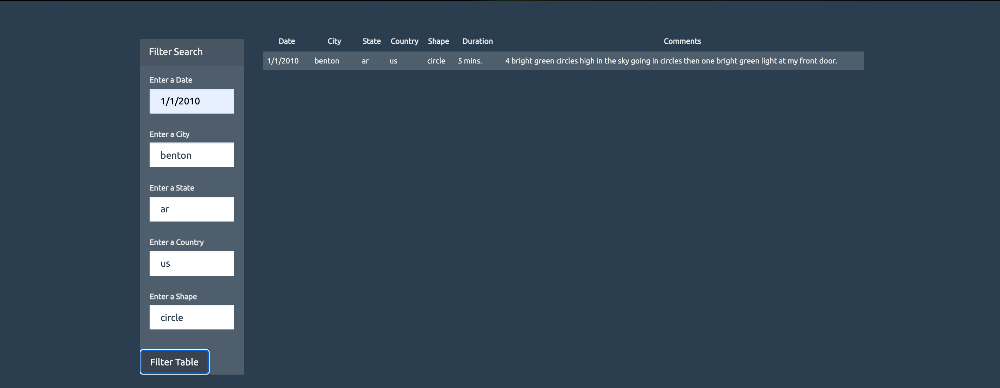
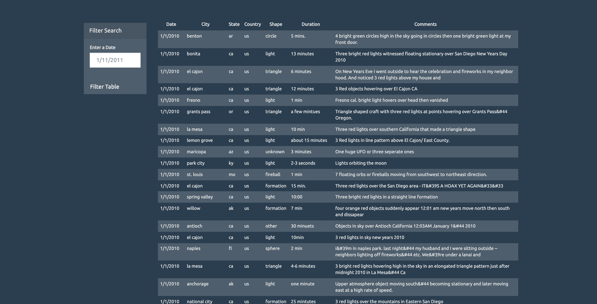

# JavaScript and DOM Manipulation

### Level 1: Automatic Table and Date Search

In UFO-level-1 part, I appended a table with provided UFO dataset in to the web page and added a filter that searches through `date/time` column to find rows that matches user input.

### Level 2: Multiple Search Categories

In UFO-level-2 part, I added multiple filters and made sure that user can filter table by multiple search:
  1. `date/time`
  2. `city`
  3. `state`
  4. `country`
  5. `shape`
